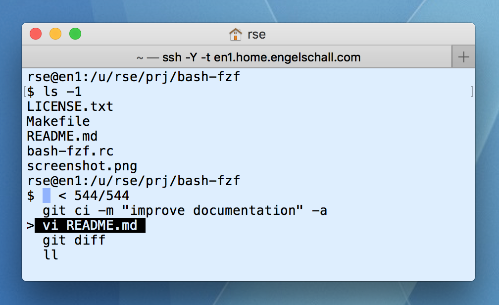

bash-fzf
========

### Enhance GNU Bash with FZF Matching



About
-----

This is an elaborated [GNU Bash](https://www.gnu.org/software/bash/)
run-command script which enhances interactive shell sessions with the following features,
all based on the excellent [FZF](https://github.com/junegunn/fzf/) searching utility:

- **improved command history searching** with overwritten FZF-based `CTRL+r` functionality,
  based on the built-in `history` command and its underlying `$HOME/.bash_history` file.

- **additional command bookmarking** with new FZF-based `CTRL+b` (bookmark) functionality,
  based on a new `bookmark` command and its underlying `.bash_bookmark` files in current,
  parent and `$HOME` directories.

- **additional directory changing** with new FZF-based `CTRL+g` (goto) functionality,
  based on a new `cdpaths` command and its underlying `.bash_cdpaths` files in current,
  parent and `$HOME` directories.

- **improved directory changing** with an overwritten `cd` command, using the
  built-in `pushd` functionality and its forward directory stack plus
  additional `cd -` (go backward in directory stack) and `cd +` (go
  forward in directory stack) commands and its underlying additional
  reverse directory stack.

Usage
-----

```
source bash-fzf.rc
```

History
-------

The functionality was invented in 1997 and was originally based on
iselect(1), an interactive selection tool by the author, a little
bit similar to FZF but without the search functionality. In 2017 the
functionality was migrated to the excellent FZF utility and the result
released as Open Source.

License
-------

Copyright (c) 1997-2018 Ralf S. Engelschall (http://engelschall.com/)

Permission is hereby granted, free of charge, to any person obtaining
a copy of this software and associated documentation files (the
"Software"), to deal in the Software without restriction, including
without limitation the rights to use, copy, modify, merge, publish,
distribute, sublicense, and/or sell copies of the Software, and to
permit persons to whom the Software is furnished to do so, subject to
the following conditions:

The above copyright notice and this permission notice shall be included
in all copies or substantial portions of the Software.

THE SOFTWARE IS PROVIDED "AS IS", WITHOUT WARRANTY OF ANY KIND,
EXPRESS OR IMPLIED, INCLUDING BUT NOT LIMITED TO THE WARRANTIES OF
MERCHANTABILITY, FITNESS FOR A PARTICULAR PURPOSE AND NONINFRINGEMENT.
IN NO EVENT SHALL THE AUTHORS OR COPYRIGHT HOLDERS BE LIABLE FOR ANY
CLAIM, DAMAGES OR OTHER LIABILITY, WHETHER IN AN ACTION OF CONTRACT,
TORT OR OTHERWISE, ARISING FROM, OUT OF OR IN CONNECTION WITH THE
SOFTWARE OR THE USE OR OTHER DEALINGS IN THE SOFTWARE.

